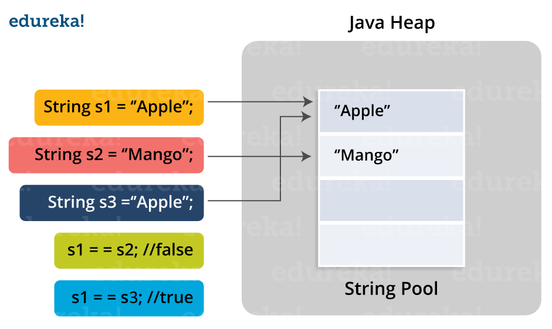
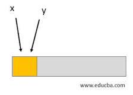

# Programming Misconceptions ⚡️

## Topics

⚡️ Python Builtin Functions and Magic Methods\
⚡️ String Pool in Java\
⚡️ Aliases in Programming\
⚡️ Interning in Programming\
⚡️ Overloading Operators\
⚡️ Pointers vs. Refrences\
⚡️ Statement vs. Expression

---

## Builtin Functions and Magic Methods 🚀

### Magic Methods

Magic methods or dunder methods are methods that are implicitly called by built in functions in python. Please consider the next few python built in function implementations to understand more about magic functions.

### len() function

len, which stands for length, is a function that basically gives the size of the things that are iterable in python. Consider following:

```
class Data:
def **len**(self):
return 42
a = Data()
print(len(a))

# 42

print(bool(a))

# True --> Because 42 != 0
```

Basically what happens in the above example, is that the len method looks for magic method **len** and sees if it is defined or not. And if it is defined it calls it. You can roughly think of len as following:

```
Def len():
  return object.**len**()
```

Question: What if an object does not have a **len** method defined? Then python will raise an exception that says

```
TypeError: object of type ‘...’ has no len().
```

Solution: Define a **len** method for that class.
Please note that object from object is different and we override **len** to make it suit our purposes.

Resources and Refrences:

- https://stackoverflow.com/questions/2481421/difference-between-len-and-len
- https://blog.finxter.com/python-__len__-magic-method/
- https://www.pythonlikeyoumeanit.com/Module4_OOP/Special_Methods.html
- https://docs.python.org/release/2.7.3/reference/datamodel.

### bool() function

bool, which stands for boolean, is a function that basically gives the truth value associated with an object in python. Consider following:

```
class Data:
def **bool**(self):
return False
x = Data()
res = bool(x)
print(res)

# ... False ...
```

Basically what happens in the above example, is that the bool method looks for magic method **bool** and sees if it is defined or not. And if it is defined it calls it. You can roughly think of bool as following:

```
Def len():
  return object.**bool**()
```

Question: What if an object does not have a **bool** method defined? Then python will use the default value which is always True.

Question: What if the **bool** returns a non-bool value? In that case python throws TypeError: **bool** should return bool, returned:

```
...some non-bool value like str…
```

Please note that object from object is different and we override **bool** to make it suit our purposes.

Resources:

- https://blog.finxter.com/python-__bool__-magic-method/

---

## String Pool in Java 🚀

String pool in java is a pool of strings sorted on java heap memory.
First let's look at the ways we can make a string in java. Consider the following:

- Using the "new" operator

```

String s1 = new String("Hello");

```

- Using string literals

```

String s1 = "Hello";

```

Which one uses a string pool? String literals use the Java string pool.

How does it work? When we use a string literal in java, JVM checks if that string exists in the string pool. If it does, it returns a reference to it. Otherwise, it allocates memory for it, puts it in the pool, and returns a reference.

<h2 align="center">
  
</h2>

Benefits: Memory allocation and creating a string are costly operations. It is possible to just use "==" instead of equals in Java to compare the strings.

Note: Making strings using the "new" operator creates a new string everytime on heap no matter if that already exists on the heap or not.

### Hows and Whys

How does JVM look for strings in the string pool?

String pool in Java uses a Hashmap in its implementation. This means that Strings are used as Keys and thir refrence is used as the value of the Strings. This data structure is considered to be very effcient since it takes advantage of hashcode to access Strings in O(1) time.

Resources and Refrences:

- Java JVM refrence [pg.360,pg.364]

---

## Aliases in Programming 🚀

Aliases in programming is when 2 or more references refer to the same object. Alias in programming is considered a bad practice and it is shown to be very error prone.

<h2 align="center">
  
</h2>

why is aliasing in programming error prone and a bad practice? The reason is the programmer at some point might change the state of the object. In that case, the other owners of the object might not be aware of the change. Hence, when used they might cause a problem.

Use cases of aliasing:
Aliases are useful when the objects that you work with are immutable such as strings in Java or integers in python. An example is string literals in Java. One or more refrences can refer to the same string.

How does Java handle polymorphism and aliasing?

Please consider the following code snippet:

```

class A {
public void methodParent() {
System.out.println("method in Parent");
}
}

class B extends A {
public void methodParent() {
System.out.println("override method in Child");
}

    public void methodChild() {
    	System.out.println("method in Child");
    }

}

public class Main {
public static void main(String[] args) {
B[] b = new B[10];
A[] a = b;

    	a[0] =  new A();
    	b[0].methodParent();
    }

}

```

Now consider following scenario:

```

public class Main {
public static void main(String[] args) {
B[] b = new B[10];
A[] a = b;

    	a[0] =  new A();
    	b[0].methodParent();
    }

}

```

This is what it looks like for refrences "a" and "b" in memory:

<h2 align="center">
  
</h2>

Explanation of the code:

We have aliases "a" and "b". After running the code snippet we will get:

```

Exception in thread “main” java.lang.ArrayStoreException: aliasingtest.A
at aliasingtest.Main.main(Main.java:26)

```

The reason is becasue Java handles aliases during run-time. It is during run-time that it understands
first element should be a B object, instead of A.

To correc the code snippet we should write it as following:

```

B[] b = new B[10];
A[] a = b;

a[0] = new B();
b[0].methodParent();

```

which produces the following output:

```

override method in Child

```

Resources and Refrences:

- https://stackoverflow.com/questions/43012375/java-polymorphism-aliasing-issue
- https://dzone.com/articles/how-does-java-handle-aliasing

---

## Interning in Programming 🚀

Interning means that there is only one copy of a distinct string on the heap. Meaning that if you have two variables that point to a string of the same value, both of them are referring to the same memory address. Basically, interning in short means a process of storing only one copy of each distinct string value in memory.

why is aliasing in programming error prone and a bad practice? The reason is the programmer at some point might change the state of the object. In that case, the other owners of the object might not be aware of the change. Hence, when used they might cause a problem.

Use cases of aliasing:

Interning is used because memory allocation is a costly operation.

Notes: Objects other than string can also be interned. Only immutable objects can be interned.

Resources and Refrences:

- https://stackoverflow.com/questions/10578984/what-is-java-string-interning

---

## Overloading Operators 🚀

What does it mean to overload an operator? It means to give an operator meaning beyond what its predefined operational meaning.

Perhaps giving an example will help you to understand more. Please pay attention to the following example:

Consider the + operator in python. It is used to add integers. It is used to merge lists. It is used to concatenate strings and…, you get the point. What if we want to give more abilities to this operator such that it will work on some object let's call it Point? Consider the code snippet below:

```

class Point:
def **init**(self, x=0, y=0):
self.x = x
self.y = y
p1 = Point(1, 2)
p2 = Point(2, 3)
print(p1+p2) (\*\*)

```

If we run this code we get the following output/error:

```

TypeError: unsupported operand type(s) for +: 'Point' and 'Point'

```

This means that the + operand still does not know how to add these two objects. In other terms it is not defined for + operator to add two points on the cartesian plane.

In order for + operator to add to cordinates we have to update the class point by defining **add** method in that class. In other words, we are overloading the + operator.

Before we continue, keep the following note in mind:
Every operator has a special magic method associated with it. For example, when we use + what it does is that it dispatches and calls the magic method **add**. And basically this method does the job for us. Now, for every custom object we define this magic method inside that class. This is how we overload the operators and give them the knowledge how to operate on different objects. Now I am going to overload the + operator to be able to operate on Point objects:

Now consider the following code snippet:

```

class Point:
def **init**(self, x=0, y=0):
self.x = x
self.y = y

    def __str__(self):
        return "({0},{1})".format(self.x, self.y)

    def __add__(self, other):
        x = self.x + other.x
        y = self.y + other.y
        return Point(x, y)

```

If we run the following code:

```

p1 = Point(1, 2)
p2 = Point(2, 3)
print(p1+p2)

```

We get the following output:

```

# (3, 5)

```

Note: Every operator has a mafic method associated with it. Example:

```

Addition p1 + p2 p1.**add**(p2)

Subtraction p1 - p2 p1.**sub**(p2)

Multiplication p1 \* p2 p1.**mul**(p2)

Bitwise AND p1 & p2 p1.**and**(p2)

Remainder (modulo) p1 % p2 p1.**mod**(p2)

```

Resources and Refrences:

- https://www.programiz.com/python-programming/operator-overloading
- https://www.geeksforgeeks.org/operator-overloading-in-python/

---

## Pointer VS. Reference 🚀

Resources and Refrences:

- https://www.programiz.com/python-programming/operator-overloading
- https://www.geeksforgeeks.org/operator-overloading-in-python/

---

## Statement VS. Expression 🚀

In rough words, expression is a line of code that can be evaluated to a value which can be used later in the program. On the other hand, a statement is a line of code that performs an action for us or makes an impact in the program.

To be more formal we define expression to be:

Some examples of expressions are following:

```

aChar = 'S'

"Hello Worl" + "d"

Character.isUpperCase(aChar)

```

An expression is a series of variables, operators, and method calls (constructed according to the syntax of the language) that evaluates to a single value.

Statements are roughly equivalent to sentences in natural languages. A statement forms a complete unit of execution. The following types of expressions can be made into a statement by terminating the expression with a semicolon (;):

- Assignment expressions
- Any use of ++ or --
- Method calls
- Object creation expressions

We have three types of statements:

- Expression statements : When you terminate an expression with ";"
- Declaration statements : When you declare a variable
- Control flow statements : Used to execute statements conditionally, repeatedly, and etc.

Note: An expression may be made of smaller pieces of expression.
Question: Can you put expressions in a statement? Yes.
Question: What about the other way around? No.

### Hows and Whys

⚡️ How is an assignment expression evaluated? What is its value?

The result of assignment expression is the value of the variable after the assignment has occurred [pg. 681]

In other words, the value of an assignment expression is like following:

```
type variable =  <value> is evaluated to be <value>.
```

Example:

```
char aChar;

aChar = 'S';

The value of " aChar = 'S' " is going to be 'S'
```

⚡️ How is assignment expression different from assignment statement?

To understand how these two are different we have to understand what expression and what statements are:

- Statements: Statements are independent units of execution in java and their aim is to be executed and possibly make side effects, which does not return any value in the program.

- Expressions: On the other hand we have an expression which is a combination of variables, method calls, etc. that together are evaluated to a value that is returned.

Now in the case of assignment expression, we have a line of code in the form of:

```
int var;

var = 1 <-- assignment expression
```

This assignment expression returns a value of 1. How and Why it returns this value is explained above. Assignment stamtents on the other hand is the same line of code which is terminated with a semicolon, which looks like

```
int var;

var = 1; <-- assignment statement
```

This only creates side effects in the program and does not return anything.

Resources and Refrences:

- Java language refrence: [pg.489,pg.491] and [pg.493] and [pg.547,pg.548] and [pg.680,pg.681]
